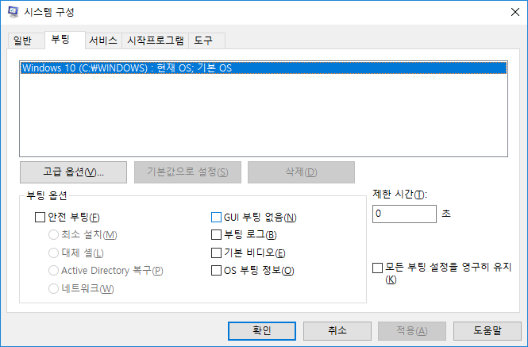

# 윈도우10 안전모드
오래동안 사용하던 프로그램이 호환성 문제로 인하여 최신 윈도우 버전과 충돌이 되는 경우가 종종 발생을 합니다.

이런경우 안전모드로 진입하여 설치하면 해결되는 경우가 많이 있습니다. 이번에는 안전모드를 이용하여 프로그램을 설치하는 방법에 대해서 알아 보도록 하겠습니다. 

실행에서 `msconfig` 명령을 입력합니다.

시스템구성 설정에서 안전모드를 설정하시면, 재부팅시 안전모드로 진입을 할 수 있습니다.

설정탭에서 `부팅`항목으로 이동합니다. 하단에 `안전부팅` 체크박스를 선택합니다.
선택후에 재부팅하면 안전모드로 진입을 할 수 있습니다.