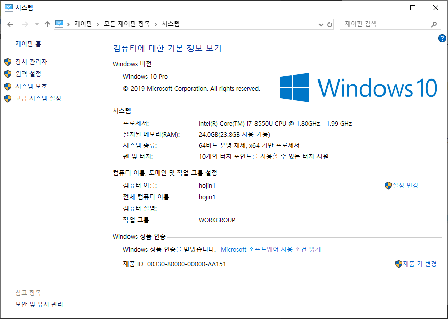
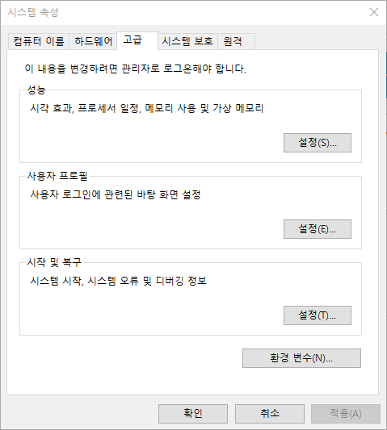
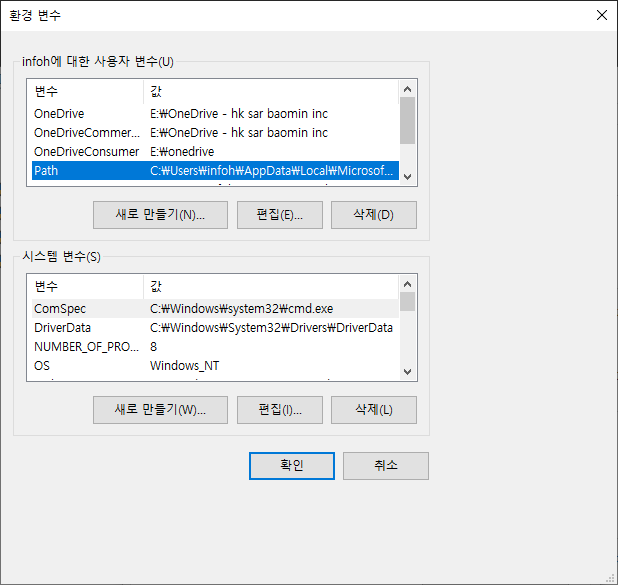
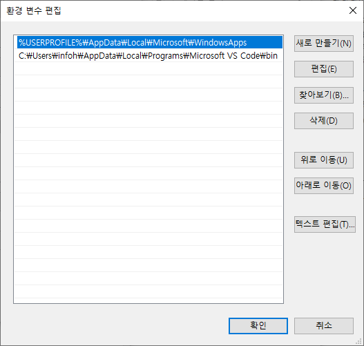

# 경로설정

윈도우는 분산되어 있는 디렉토리의 실행파일을 쉽게 접근할 수 있도록 `path`설정을 할 수 있습니다.

## 제어판 실행

먼저 제어판을 실행합니다. 윈도우 검색창에서 `제어판`을 입력합니다.

제어판을 실행합니다. 제어판에서 `시스템`을 선택합니다.

왼쪽 메뉴에서 `고급시스템 설정`을 선택합니다.

하단의 `환경변수`를 선택합니다.

## 경로 추가

`Path` 항목을 선택후에 `편집`을 클릭합니다. Path 경로를 수정할 수 있는 창이 실행이 됩니다.

`새로만들기`를 클릭하여 경로를 추가합니다.

예를 들어 `C:\Bitnami\wampstack-7.1.30-0\php\php.exe` 파일을 실행할 수 추가하고자 합니다. 경로를 추가할 때는 실행파일을 제외한 경로만 입력을 합니다. `C:\Bitnami\wampstack-7.1.30-0\php\`만 적어 주시면 됩니다.
