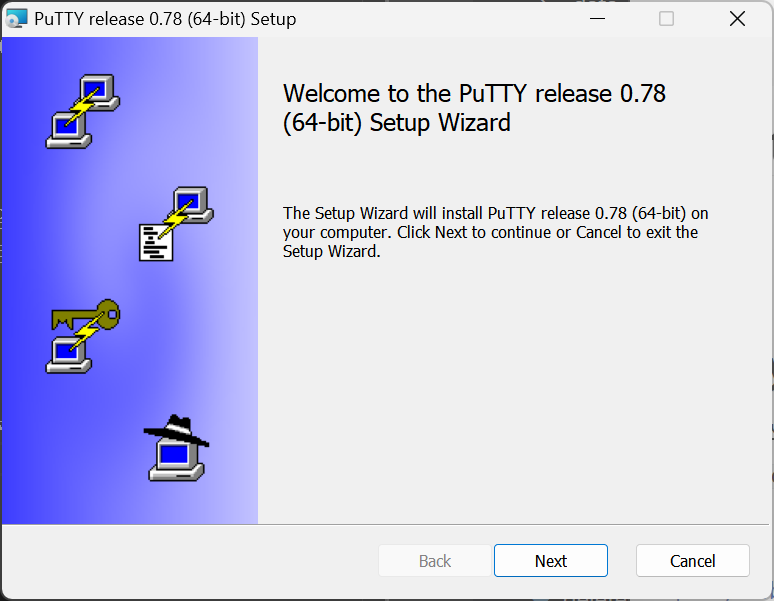
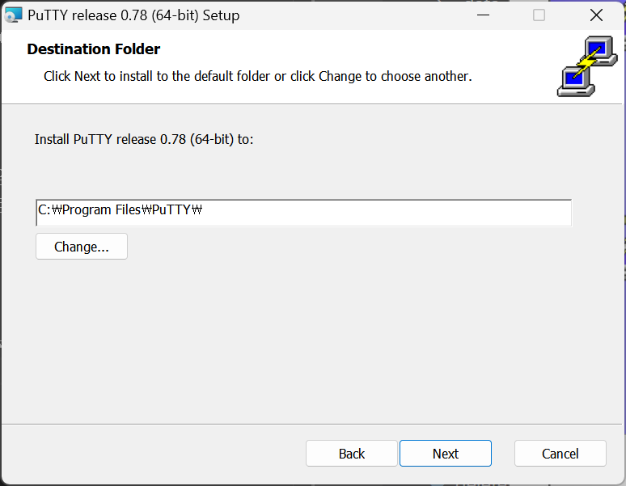
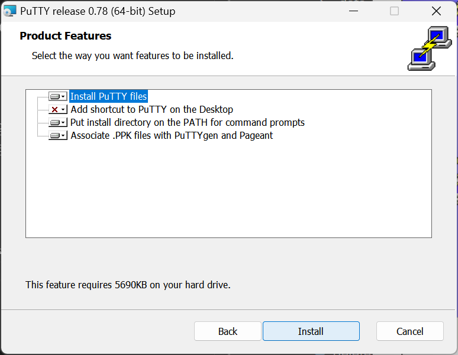
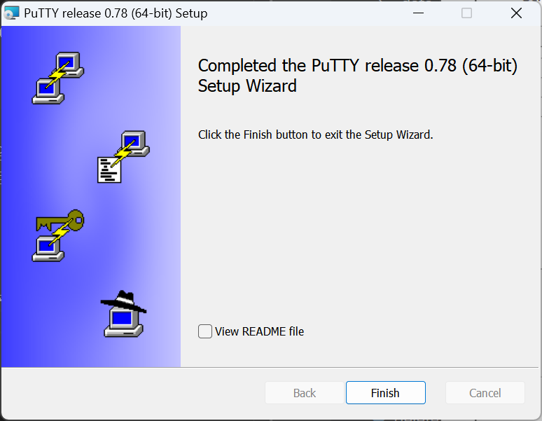
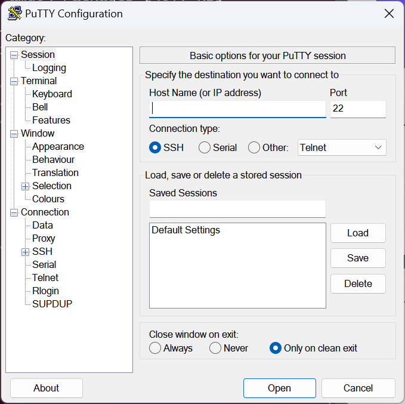

# Putty란
PuTTY는 SSH, 텔넷, rlogin, raw TCP를 위한 클라이언트로 동작하는 자유 및 오픈 소스 단말 에뮬레이터 응용 프로그램이다. PuTTY라는 이름에는 특별한 뜻이 없으나 tty는 유닉스 전통의 터미널의 이름을 가리키며 teletype를 짧게 줄인 것이다. [위키피디아](https://ko.wikipedia.org/wiki/PuTTY)

## putty 설치하기
putty 공식사이트로 이동합니다. https://www.putty.org/
`Download Putty`를 선택하여 파일을 [다운로드](https://www.chiark.greenend.org.uk/~sgtatham/putty/latest.html) 받습니다.

윈도우의 경우 64-Bit x86 버젼을 다운로드 받습니다.  

[putty-64bit-0.78-installer.msi](https://the.earth.li/~sgtatham/putty/latest/w64/putty-64bit-0.78-installer.msi)

`이 앱이 디바이스를 변경할 수 있도록 허용`을 확인해 줍니다.

설치가 정상적으로 완료 되었습니다.

## putty로 외부 접속하기

윈도우 컴퓨터에 putty가 정상적으로 설치가 되었습니다. `시작`을 눌러보면 다음과 같은 아이콘을 볼 수 있습니다.

putty를 실행해 봅니다. 다음과 같은 화면을 볼 수 있습니다.

putty를 이용하여 원격 서버에 접속을 하기 위해서는 `서버의 주소`와 `접속 포트`를 알고 있어야 합니다.
