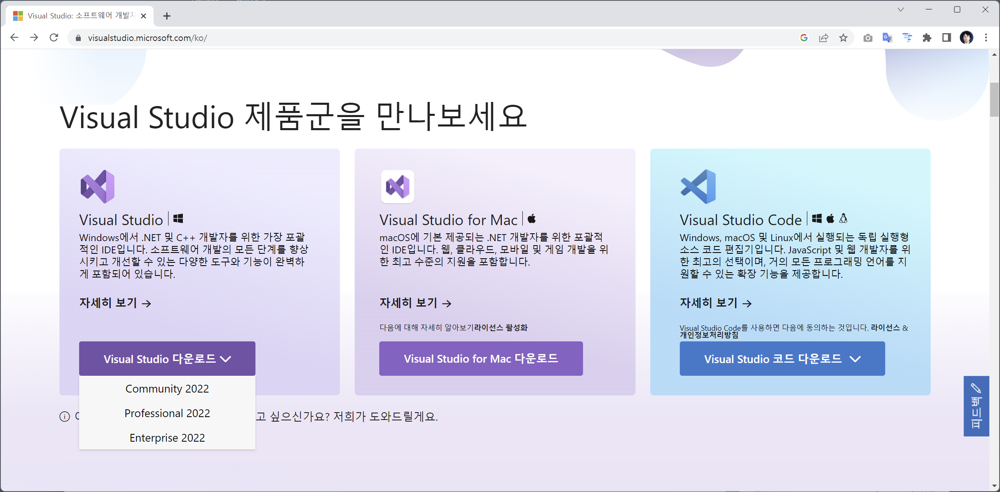

# C/C++ 및 윈도우 응용프로그램 개발

C/C++은 가장 인기있는 Low 레벨의 개발 언어 입니다. 또한, 마이크로소프트의 응용 프로그램을 개발하기 위한 도우이기도 합니다.

##  Visual Studio

마이크로소프트의 대표적인 통합 개발 도구 입니다. 과거에는 비싼 가격 때문에 일반인이 쉽게 사용을 하기 어려웠으나, 지금은 `무로 comunity` 버젼을 제공하고 있습니다.

[다운로드 링크](https://visualstudio.microsoft.com/ko/)

